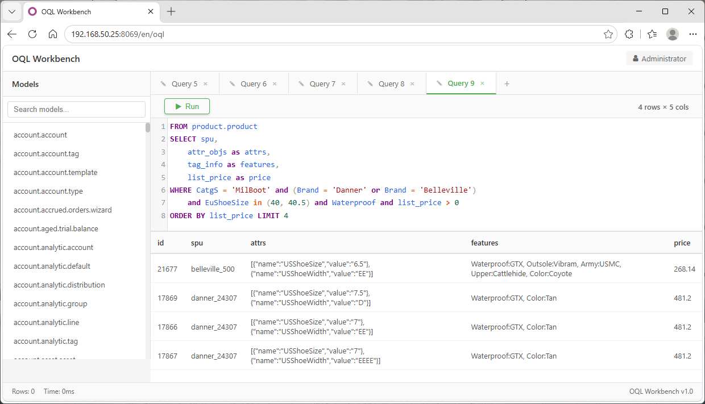
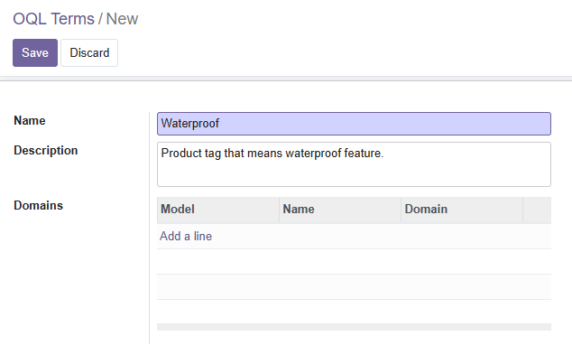
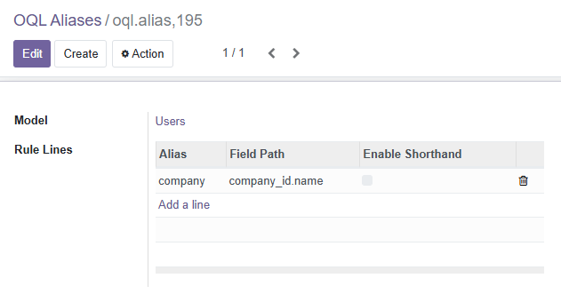
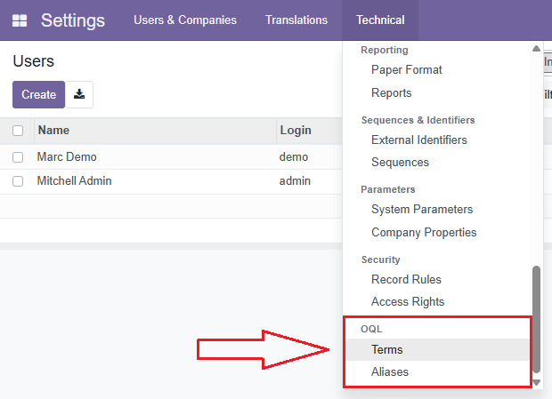

=========================
OQL - Odoo Query Language
=========================

Query Odoo ORM models with **intuitive, business-focused syntax**.
Write *what* you mean — not *how* to find it.

-------------------------------------------------------------------------------
Simple Usage
-------------------------------------------------------------------------------

Get started with OQL in minutes. No configuration required — you can query any
model immediately using field names, aliases, or pre-configured terms.

Quick Start
-----------

**1. Install**

Place the ``oql`` module in your addons path and install it from the Odoo Apps menu.
No dependencies beyond ``base``.

**2. Query**

Use ``searcho()`` instead of ``search()``, or ``oql()`` for full queries::

    # Simple search (WHERE clause only) — returns recordset
    products = env['product.product'].searcho("name like 'Boot' and list_price > 50")

    # Full query with SELECT, LIMIT, OFFSET — returns List[dict]
    results = env['product.product'].oql(
        "from product.product select name, list_price, partner_id.name "
        "where active = true order by list_price desc limit 10 offset 20"
    )

That's it! Start writing queries immediately. For terms, aliases, ACL, and
operator overloading, see :ref:`advanced-usage` below.

The Problem — And the OQL Solution
----------------------------------

How many lines of code does it take to find waterproof Danner boots in EU sizes
40-40.5?

**Traditional Odoo Domain — 30+ lines, 4 preparatory searches**

.. code-block:: python

    # Step 1: Find category records (2 searches)
    boot_catg = env['product.category'].search([
        ('name', '=', 'Boot'), ('level', '=', 'CatgS')
    ])
    danner_brand = env['product.category'].search([
        ('name', '=', 'Danner'), ('level', '=', 'Brand'),
        ('parent_id', 'child_of', boot_catg.ids)
    ])

    # Step 2: Find attribute values (1 search)
    size_values = env['product.attribute.value'].search([
        ('attribute_id.name', '=like', 'EU Shoe Size'),
        ('name', 'in', ['40', '40.5'])
    ])

    # Step 3: Find tags (1 search)
    waterproof_tags = env['product.template.tag'].search([
        ('name', '=like', 'Waterproof')
    ])

    # Step 4: Build domain and execute
    products = env['product.product'].search([
        ('categ_id', 'child_of', danner_brand.ids),
        ('product_template_attribute_value_ids.product_attribute_value_id',
         'in', size_values.ids),
        ('tag_ids', 'in', waterproof_tags.ids)
    ])

**OQL — 1 line, zero prep**

.. code-block:: python

    products = env['product.product'].searcho(
        "CatgS = 'Boot' and Brand = 'Danner'"
        " and EuShoeSize in ('40', '40.5')"
        " and Waterproof"
    )

.. tip::

   - **Business-focused** — uses terms like "Waterproof" instead of field paths
   - **Readable** — reads like natural language; business users can verify logic
   - **Maintainable** — one line; trivial to modify
   - **Efficient** — no preparatory searches; OQL resolves everything internally

API Reference
-------------

Three methods are added to every Odoo model:

``searcho(where: str) -> Model``
    Shortcut for recordset search. Accepts a **WHERE clause only**.

    ::

        env['product.product'].searcho("active = true and list_price > 100")

``searcho_ids(where: str) -> List[int]``
    Same as ``searcho()`` but returns only record IDs.

    ::

        env['product.product'].searcho_ids("list_price = null")

``oql(query: str) -> List[dict]``
    Full query with SELECT, FROM, WHERE, ORDER BY, LIMIT, OFFSET.
    Returns a list of dictionaries.

    ::

        env['product.product'].oql(
            "from product.product"
            " select name, list_price, partner_id.name"
            " where active = true"
            " order by name asc"
            " limit 50 offset 0"
        )

.. note::

   ``searcho()`` and ``searcho_ids()`` internally call ``oql()`` by prepending
   ``FROM <model> SELECT id WHERE`` before your WHERE clause.

Query Syntax
------------

An OQL query follows this structure::

    FROM <model>
    SELECT <field> [AS <alias>], ...
    [WHERE <conditions>]
    [ORDER BY <field> [ASC|DESC], ...]
    [LIMIT <n>]
    [OFFSET <n>]

Key differences from SQL: **clause order is FROM → SELECT → WHERE** (not
SELECT → FROM → WHERE), and all keywords are case-insensitive.

Operators
~~~~~~~~~

+-------------+----------------------------------------------------+-----------------------------------+
| Category    | Operators                                          | Example                           |
+=============+====================================================+===================================+
| Comparison  | ``=``, ``!=``, ``<>``, ``>``, ``>=``, ``<``,      | ``price > 100``                   |
|             | ``<=``                                             |                                   |
+-------------+----------------------------------------------------+-----------------------------------+
| Pattern     | ``like``, ``ilike``, ``not like``,                 | ``name like 'Boot'``              |
|             | ``not ilike``                                      | (auto-wraps ``%`` — no need to    |
|             |                                                    | add wildcards)                    |
+-------------+----------------------------------------------------+-----------------------------------+
| Set         | ``in``, ``not in``                                 | ``Size in ('40', '40.5')``        |
+-------------+----------------------------------------------------+-----------------------------------+
| Hierarchy   | ``child_of``, ``parent_of``                        | ``categ_id child_of root``        |
+-------------+----------------------------------------------------+-----------------------------------+
| Null        | ``is null``, ``is not null``                       | ``partner_id is null``            |
+-------------+----------------------------------------------------+-----------------------------------+
| Unset       | ``=?``                                             | ``partner_id =? partner_id``      |
+-------------+----------------------------------------------------+-----------------------------------+

.. note::

   ``like`` / ``ilike`` automatically wrap the value with ``%`` (equivalent to
   Odoo's ``=like`` / ``=ilike`` domain operators). Use ``=like`` or ``=ilike``
   for Odoo-native behaviour if you need explicit ``%`` placement.

Logical Operators & Grouping
~~~~~~~~~~~~~~~~~~~~~~~~~~~~

::

    # AND
    searcho("Brand = 'Danner' and Waterproof")

    # OR
    searcho("Size = '40' or Size = '40.5'")

    # NOT
    searcho("not Waterproof")

    # Parentheses for grouping
    searcho("(Brand = 'Danner' or Brand = 'Merrell') and Waterproof")
    searcho("(Size in ('40', '40.5') and Waterproof) or (Size = '42' and Breathable)")

Unary Expressions (Existence Checks)
~~~~~~~~~~~~~~~~~~~~~~~~~~~~~~~~~~~~

Use a bare field or term to check for existence — no operator or value needed::

    # Products that have any tags
    searcho("tag_ids")

    # Active products
    searcho("active")

    # Products tagged with a term
    searcho("Waterproof")

Dot Notation
~~~~~~~~~~~~

Access related fields with dot paths in both WHERE and SELECT clauses::

    # WHERE — filter by related field
    searcho("partner_id.country_id.name = 'US'")

    # SELECT — read related field with AS alias
    env['product.product'].oql(
        "from product.product"
        " select name, partner_id.name as partner_name"
        " where active = true"
    )

Values
~~~~~~

+-------------------+-----------------------------------+
| Type              | Syntax                            |
+===================+===================================+
| String            | ``'Boot'`` (single-quoted,        |
|                   | ``''`` escapes to ``'``)          |
+-------------------+-----------------------------------+
| Integer           | ``42``, ``-5``                    |
+-------------------+-----------------------------------+
| Float             | ``99.99``, ``-0.5``               |
+-------------------+-----------------------------------+
| Boolean           | ``true``, ``false``               |
+-------------------+-----------------------------------+
| Null              | ``null``                          |
+-------------------+-----------------------------------+
| Array (for IN)    | ``('40', '40.5', '41')``          |
+-------------------+-----------------------------------+

.. _advanced-usage:

-------------------------------------------------------------------------------
Advanced Usage
-------------------------------------------------------------------------------

This section covers configuration-driven features that unlock OQL's full power:
Terms, Aliases, Operator Overloading, and Access Control.

.. note::

   These features require setup via **Settings → Technical → OQL**.
   Once configured, they are available to all users of the model.

1. Terms — Business Terminology
-------------------------------

Terms map **business words** to **record sets**. Instead of writing complex
domain expressions, you define meaningful names and use them directly in queries.

How Terms Work
~~~~~~~~~~~~~~

When OQL encounters a word in a query that isn't a field name or alias, it
tries to resolve it as a Term. Terms resolve via two strategies:

**Strategy 1 — Domain rules** (configured via UI)

Navigate to **Settings → Technical → OQL → Terms**, create a term, and add
domain rules that define which records the term matches.

For example, a "Waterproof" term could have a domain rule on
``product.template.tag``: ``[('name', '=like', 'Waterproof')]``.

Each term can have multiple domain rules for different target models.

**Strategy 2 — Many2many references** (auto-discovered)

OQL automatically discovers which records are "tagged" with a term by scanning
all Many2one/Many2many fields whose ``relation`` is ``oql.term``.

To use this, add a ``term_ids`` field to your business models:

.. code-block:: python

    from odoo import models, fields

    class ProductAttribute(models.Model):
        _inherit = 'product.attribute'

        term_ids = fields.Many2many('oql.term', string='Terms')

Then associate terms with records through the form view. When you use the term
in a query, OQL finds all records linked to that term and uses their IDs to
build the domain.

.. tip::

   Domain rules and Many2many references are **cumulative** — if a term has
   both, their results are merged with AND logic.

Using Terms in Queries
~~~~~~~~~~~~~~~~~~~~~~

Once configured, use terms directly::

    # Bare term — existence check
    env['product.product'].searcho("Waterproof")

    # Term with value — triggers __oql_bin__ (see Operator Overloading)
    env['product.product'].searcho("EuShoeSize = '40'")

    # Term with IN clause
    env['product.product'].searcho("EuShoeSize in ('40', '40.5')")

.. note::

   When a term appears with an operator and value (e.g. ``EuShoeSize = '40'``),
   OQL does **not** use domain rules directly. Instead, it calls the model's
   ``__oql_bin__()`` method. See :ref:`operator-overloading` below.

2. Aliases — Path Simplification
---------------------------------

Aliases **shorten long field paths** into concise, memorable names.

Replace ``product_tmpl_id.default_code`` with ``spu``, or
``partner_id.country_id.name`` with ``country``.

Configuring Aliases
~~~~~~~~~~~~~~~~~~~

Navigate to **Settings → Technical → OQL → Aliases** and add alias rules for
your models.

Three Path Modes
~~~~~~~~~~~~~~~~

**Field mode** — Simple dot-notation field path (default).

::

    # Alias: spu → product_tmpl_id.default_code
    searcho("spu = 'BOOT-001'")

**JMESPath mode** — JSON query expressions for data transformation. Useful for
extracting nested data or reshaping complex structures.

.. code-block:: json

    {name: rec.partner_id.name, email: rec.partner_id.email}

Supports array projections::

    rec.order_lines[].{product: product_id.name, qty: quantity}

**Jinja2 mode** — Template strings for formatted output. Uses ``rec`` as the
context variable.

.. code-block:: jinja

    {{ rec.partner_id.name }}

    
    {{ line.product_id.name }} × {{ line.quantity }}
    

Shorthand Auto-Resolution
~~~~~~~~~~~~~~~~~~~~~~~~~

Enable "Shorthand" on an alias line to let OQL automatically select the correct
field path by matching the **value type**.

For example, if a model has:
- ``attribute_value_ids`` (relates to ``product.attribute.value``)
- ``name`` (a Char field)

You can enable shorthand on both. When OQL encounters ``@ = 'Boot'``, it matches
the value type ``str`` and uses the ``name`` path. When it encounters
``@ = attribute_value_record`` (a RecordSet), it matches the model
``product.attribute.value`` and uses ``attribute_value_ids``.

.. important::

   At most **one** shorthand per value type per model. This prevents ambiguity.

Complex vs Simple Aliases
~~~~~~~~~~~~~~~~~~~~~~~~~

- **Simple aliases** (Field mode) can appear anywhere in a field path and can
  be used in WHERE clauses for searching.
- **Complex aliases** (JMESPath, Jinja2) can only appear at the **tail** of a
  field path and cannot be used in WHERE clauses (only SELECT).

Using Aliases in Queries
~~~~~~~~~~~~~~~~~~~~~~~~

::

    # Without alias — verbose
    searcho("product_tmpl_id.default_code = 'BOOT-001'")

    # With alias — clean
    searcho("spu = 'BOOT-001'")

    # Aliases in SELECT with AS
    oql("from product.product"
        " select spu as sku, partner_id.name as partner"
        " where active = true")

.. _operator-overloading:

3. Operator Overloading (``__oql_bin__``)
-----------------------------------------

When a **Term** appears with an operator and value (e.g. ``EuShoeSize = '40'``),
OQL calls the target model's ``__oql_bin__()`` method to resolve the operation.

This is essential for terms that map to parent records but need to filter by
child records — for example, resolving "EuShoeSize" (a product attribute) to
specific sizes (product attribute values).

.. code-block:: python

    class ProductAttribute(models.Model):
        _inherit = 'product.attribute'

        def __oql_bin__(self, domain, opr, value, value_domain):
            """
            Custom logic for term-based binary operations.

            :param self: Records pre-filtered by ``domain`` (empty if none).
            :param domain: OqlDomain for the left operand (the term's domain).
            :param opr: Odoo domain operator (=, !=, in, like, ...).
            :param value: Right operand (scalar, list, or RecordSet).
            :param value_domain: Domain of the right operand when it's a RecordSet.
            :return: A recordset (must not be None).
            """
            if domain.name == 'self.term_ids':
                # Search child attribute values matching the operator
                return self.value_ids.search(
                    [('name', opr, value)]
                )
            raise NotImplementedError()

With this implementation, ``EuShoeSize = '40'`` works as follows:

1. OQL finds attribute records tagged with the "EuShoeSize" term
2. Calls ``__oql_bin__`` on the pre-filtered attribute records
3. The method searches ``value_ids`` (child records) for ``name = '40'``
4. Returns matching ``product.attribute.value`` records
5. OQL uses these records to filter the parent model

.. warning::

   ``__oql_bin__`` must return a recordset (``models.Model`` instance).
   Returning ``None`` raises ``NotImplementedError``.

4. Access Control (OQL ACL)
----------------------------

OQL provides **its own field-level access control layer**, completely separate
from Odoo's standard ACL. OQL ACL controls which fields and aliases can be
accessed through ``searcho()`` and ``oql()`` queries.

.. important::

   OQL ACL **only** affects OQL queries. Standard Odoo ORM operations
   (``read()``, ``search()``, ``write()``) are **not** restricted by OQL ACL.
   Internally, OQL uses ``sudo()`` to bypass Odoo's ACL and enforces its own.

Configuration
~~~~~~~~~~~~~

Navigate to **Settings → Technical → Security → Access Rights**, open any
``ir.model.access`` record, and you'll find OQL-specific tabs:

- **Default Read Access** / **Default Write Access** — controls if fields are
  readable/writable by default (defaults to ``True``)
- **OQL Field Access** tab — per-field read/write overrides
- **OQL Alias Access** tab — per-alias read/write overrides

How ACL Is Enforced
~~~~~~~~~~~~~~~~~~~

**Field-level:** Each field path in WHERE and SELECT is checked. If any field
in the path lacks read access, the query is blocked with an ``AccessError``.

**Alias-level:** Each alias is checked against the user's alias permissions.

**Alias field inheritance:** An alias is accessible if **either**:

1. It has its own explicit alias-level permission, **or**
2. **All** fields it references are individually accessible

**Related field inheritance:** A related field (e.g. ``tmpl_name`` pointing to
``product_tmpl_id.name``) is accessible if **either**:

1. It has its own explicit field-level permission, **or**
2. The complete target path (both the relational field and the target field) is
   accessible

**Record rules (ir.rule):** Odoo's standard record rules are still applied.
On every query, ``ir.rule._compute_domain()`` is AND‑merged with the query's
domain, ensuring users only see records their groups permit.

Example
~~~~~~~

Restrict users to query only ``name`` and ``list_price`` via OQL::

    # Default Read Access = False
    # Grant read to: name, list_price

    # ✓ Works — name is accessible
    searcho("name like 'Boot'")

    # ✗ AccessError — default_code is blocked
    oql("from product.product select default_code where active = true")

    # Note: standard read() is unaffected
    products.read(['default_code'])  # ✓ Still works

Architecture
------------

Query Execution Pipeline
~~~~~~~~~~~~~~~~~~~~~~~~

::

    OQL String
        │
        ▼
    Lark Parser (LALR)
        │  oql.lark grammar
        ▼
    Parse Tree
        │
        ▼
    OqlTransformer.transform()
        │  ┌─── FROM clause: ACL check, sudo() model
        │  ├─── SELECT clause: resolve * → all permitted fields
        │  ├─── WHERE clause: evaluate expression tree
        │  │      ├── Field path?   → traditional Odoo domain tuple
        │  │      ├── Term + value? → __oql_bin__()
        │  │      ├── Bare term?    → pre_domain (term's domain)
        │  │      ├── Alias?        → expand to field path
        │  │      └── OR/AND?       → merge RecordSets
        │  ├─── ORDER BY: validate stored fields only
        │  ├─── LIMIT/OFFSET: pass through
        │  └─── Build final domain, apply ir.rule
        ▼
    Odoo ORM (search + read)
        │
        ▼
    List[dict]  (oql)  /  Model (searcho)

Lazy Loading & Caching
~~~~~~~~~~~~~~~~~~~~~~

OQL uses a **lazy-loading** metadata store (``OqlMeta``) backed by
``KeyPassingDefaultDict`` — a dictionary whose default factory receives the
missing key as an argument. This means:

- Terms are loaded on first use, then cached
- Aliases are loaded per model on first access, then cached
- After the first full term load (triggered by any term access), the cache
  is locked — new terms won't appear until server restart

Best Practices
--------------

When to Use OQL
~~~~~~~~~~~~~~~

- Complex queries involving multiple related models
- User-facing search features where readability matters
- Business rules that change frequently
- Scenarios where non-developers need to understand or verify queries

When to Use Traditional Domains
~~~~~~~~~~~~~~~~~~~~~~~~~~~~~~~

- Simple, single-model queries with no related fields
- Performance-critical hot paths (OQL adds parsing overhead)
- Cases requiring very specific Odoo ORM features not expressible in OQL

Performance
~~~~~~~~~~~

- Term and alias metadata is cached after first load
- Complex alias chains add per-record overhead (limit their use in large
  result sets)
- Use ``enable_shorthand`` judiciously — it adds type-checking overhead during
  resolution
- For bulk data exports, use ``oql()`` with ``limit`` and ``offset`` for
  pagination

Naming Conventions
~~~~~~~~~~~~~~~~~~

- **Terms:** Use clear, business-oriented names (``EuShoeSize``, not
  ``eu_size_attr``)
- **Aliases:** Keep them short but descriptive (``spu`` for standard product
  unit, ``country`` for ``partner_id.country_id.name``)
- Document term and alias meanings for team reference

-------------------------------------------------------------------------------

Installation
------------

1. Place the ``oql`` module in your Odoo addons path
2. Update the app list and install "OQL - Odoo Query Language" from the Apps menu
3. No additional dependencies beyond ``base``

Live Demo
---------

See OQL in action:

.. image:: static/description/preview.gif
   :alt: OQL Search Demo - Writing business-focused queries in Odoo
   :align: center
   :width: 100%

Support and Contribution
------------------------

For issues, feature requests, or contributions:
https://github.com/chrisking94/odoo_addons/tree/main/oql

License
-------

LGPL-3
