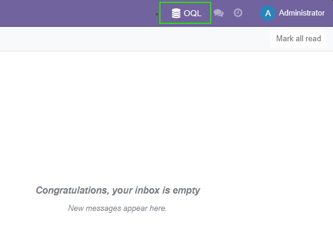
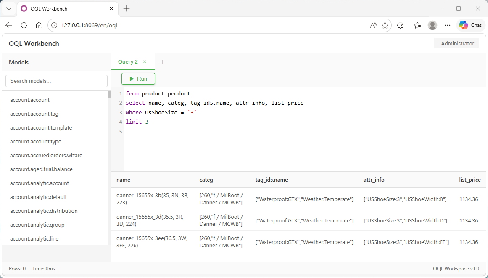

================
Advanced Search
================

.. image:: /oql_web/static/description/icon.png
   :alt: Advanced Search Logo
   :align: center
   :width: 200px

.. image:: https://img.shields.io/badge/license-%20%20GNU%20LGPLv3%20-green?style=plastic&logo=gnu
   :target: https://www.gnu.org/licenses/lgpl-3.0.txt
   :alt: License: LGPL-3

.. image:: https://img.shields.io/badge/github-repo-blue?logo=github
   :target: https://github.com/hypsai/odoo_addons/tree/main/oql_web
   :alt: Github Repo

**Type-to-search: replace Odoo's click-based search with a powerful text query bar**

Transform your Odoo search bar into a powerful text editor with syntax highlighting, autocomplete, and intelligent search capabilities. Just type your query and press Enter — no more clicking through filter widgets.

Why This Module?
================

**The Simplest Way to Use OQL in Odoo UI:**

While OQL (Odoo Query Language) simplifies query writing at the code level, users still need a convenient way to execute these queries through the Odoo interface. The native search bar only supports traditional domain-based searches.

**Advanced Search Solution:**

* **Syntax Highlighting**: Color-coded keywords, operators, and values
* **Smart Autocomplete**: Intelligent suggestions for terms and aliases (with oql_pro)
* **Search History**: Automatically saves and restores previous queries
* **Toggle Mode**: Switch between native search and OQL anytime
* **Persistent State**: Your preferences survive page refreshes

Quick Start
===========

1. Install the OQL module (required dependency)
2. Install Advanced Search in your Odoo instance
3. Click the "OQL" button next to the search bar and start querying

.. important::
   **Prerequisite**: Advanced Search requires the ``oql`` module to be installed first.
   Get it from `Odoo App Store <https://apps.odoo.com/apps/modules/15.0/oql>`_.

Live Demo
=========

See Advanced Search in action! The following demo shows the search interface with syntax highlighting and intelligent features:

.. image:: static/description/preview.gif
   :alt: Advanced Search Demo - Syntax highlighting and smart search in Odoo
   :align: center
   :width: 100%

OQL Query Workbench
===================

For advanced query development, access the **OQL Workbench** by clicking the OQL button in the top navigation bar:

This opens a full-screen IDE at ``/oql``:

**Key Features:**

* Multi-tab interface for multiple queries
* Model browser for quick query creation
* Auto-save workspace state
* Cloud sync + localStorage backup

Key Features
============

Syntax Highlighting
-------------------

Advanced Search uses CodeMirror to provide professional-grade syntax highlighting based on the OQL grammar:

* **Keywords**: Logical operators (AND, OR, NOT) highlighted in distinct colors
* **Operators**: Comparison operators (=, !=, >, <, IN, LIKE) clearly visible
* **Values**: String literals and numbers styled differently for readability
* **Terms & Aliases**: Business terms and field aliases highlighted for quick identification

This visual feedback helps you write correct queries faster and catch syntax errors immediately.

Intelligent Search Bar Integration
-----------------------------------

Advanced Search seamlessly integrates with Odoo's native search bar:

**Toggle Button**

A compact "OQL" button appears next to the search bar:

* Click to switch between native search and OQL mode
* Button turns blue when OQL mode is active
* State persists across page refreshes

**Seamless Replacement**

When OQL mode is enabled:

* Native search box is completely hidden
* OQL editor takes its place with full width
* Press Enter to execute search (just like native search)
* Results display using standard Odoo list views

**Zero Learning Curve**

If you're familiar with OQL syntax, you can start using Advanced Search immediately. The interface behaves exactly like the native search bar you already know.

Search History Management
--------------------------

Never lose your favorite queries again:

**Automatic Saving**

* Every successful OQL query is automatically saved to localStorage
* History is scoped per user and model (no clutter from other views)
* Stores up to 50 most recent queries

**Quick Access**

* Click the history icon (📋) in the editor to view past queries
* Click any history item to load it into the editor
* Each item shows the query text and timestamp

**History Actions**

* **Select Item**: Loads query into editor and executes search
* **Delete Item**: Removes individual query from history
* **Clear All**: One-click cleanup of entire history

**Persistence**

* History survives browser restarts
* Separate history for each Odoo model
* User-specific (no cross-user pollution)

State Persistence
-----------------

Advanced Search remembers your preferences:

**Toggle State**

* If you were in OQL mode when you left a view, it reactivates automatically
* No need to click the toggle button every time

**Last Query Cache**

* Your last OQL query is cached per model
* When you return to the same view, the query is restored
* Cursor position is also preserved for seamless continuation

**Smart Restoration**

* Cached queries are loaded after the editor initializes
* Auto-executes search to restore your previous results
* All happens smoothly without manual intervention

Installation
============

Prerequisites
-------------

**Required:**

1. **OQL Module** - The core OQL engine
   
   Install from: https://apps.odoo.com/apps/modules/15.0/oql

**Optional but Recommended:**

2. **OQL Pro** - Enhanced autocomplete and intelligent suggestions
   
   Install from: https://apps.odoo.com/apps/modules/15.0/oql_pro

Without OQL Pro, you still get syntax highlighting and history management, but autocomplete suggestions will be basic.

Installation Steps
------------------

1. **Download**
   
   Get ``oql_web-x.x.x.zip`` from Odoo App Store or GitHub

2. **Extract**
   
   Unzip and copy the ``oql_web`` folder to your Odoo addons path:
   
   * Linux: ``/opt/odoo/addons/oql_web``
   * Windows: ``C:\Program Files\Odoo 15.0\server\addons\oql_web``

3. **Install**
   
   * Enable Developer Mode: Add ``?debug=1`` to your Odoo URL
   * Navigate to **Apps** menu
   * Click **Update Apps List** (top menu)
   * Search for "**Advanced Search**"
   * Click **Install**

4. **Verify**
   
   Open any list view (e.g., Products, Customers). You should see an "OQL" button next to the search bar.

Usage Examples
==============

Basic Usage
-----------

**Step 1: Activate OQL Mode**

Click the **OQL** button on the left side of the search bar. The button will turn blue, and the search box will transform into an OQL editor.

**Step 2: Write Your Query**

Type your OQL query using business terms:

.. code-block:: text

    # Simple query
    Waterproof

    # With comparison
    Size = '40'

    # Complex conditions
    Brand = 'Danner' and EuShoeSize in ('40', '40.5') and Waterproof

**Step 3: Execute Search**

Press **Enter** to run the query. Results appear just like native Odoo search.

**Step 4: Toggle Back**

Click the OQL button again to return to native search mode.

Advanced Features
-----------------

**View Search History**

Click the history icon (📋) on the right side of the editor to see your past queries. Click any item to reload and re-execute it.

**Manage History**

* **Delete single item**: Click the trash icon next to any history entry
* **Clear all history**: Click "Clear All History" at the bottom of the dropdown

**Keyboard Shortcuts**

* **Enter**: Execute current query
* **Ctrl+Space**: Trigger autocomplete (if oql_pro installed)
* **Escape**: Close history dropdown

Tips and Best Practices
=======================

When to Use Advanced Search
---------------------------

* Quick data exploration and filtering
* Repeated searches with slight variations
* Testing OQL queries before embedding in code
* Business users who prefer visual interfaces
* Training teams on OQL syntax

When to Use Code-Based OQL
--------------------------

* Queries embedded in Python modules
* Automated reports and scheduled actions
* Complex queries requiring programmatic construction
* Performance-critical operations

Pro Tips
--------

1. **Start Simple**: Begin with single-term queries, then add complexity
2. **Use History**: Save frequently used queries for one-click access
3. **Learn Syntax**: Familiarize yourself with OQL operators and expressions
4. **Combine with OQL Pro**: Get intelligent autocomplete for faster query writing
5. **Share Queries**: Copy-paste OQL queries to share with teammates

Troubleshooting
===============

OQL Button Not Visible
----------------------

If you can't see the OQL toggle button next to the search bar:

1. Verify OQL module is installed and working
2. Check that Advanced Search module is installed (Apps → Search "Advanced Search")
3. Clear browser cache and reload the page
4. Ensure you're viewing a list view (not form or kanban)

Syntax Highlighting Not Working
--------------------------------

If editor shows plain text without colors:

1. Check browser console for JavaScript errors
2. Verify CodeMirror library loaded correctly (check Network tab)
3. Try clearing browser cache
4. Ensure no conflicting modules are overriding assets

History Not Saving
------------------

If queries don't appear in history dropdown:

1. Check if browser localStorage is enabled
2. Verify query executed successfully (no errors)
3. Check browser console for storage-related errors
4. Try in incognito/private mode to rule out extensions

Performance Issues
------------------

If editor feels slow or unresponsive:

1. Reduce number of items in history (clear old entries)
2. Disable browser extensions that might interfere
3. Check if oql_pro is causing conflicts (try without it)
4. Ensure Odoo server is responding quickly

Comparison: Advanced Search vs Native Search
=============================================

========================  ====================  ====================
Feature                   Native Search         Advanced Search
========================  ====================  ====================
Query Syntax              Domain filters        OQL (business terms)
Readability               Technical             Natural language
Complexity Limit          Multiple widgets      Single line
Syntax Highlighting       No                    Yes
Autocomplete              Field names           Terms + aliases*
Search History            Manual                Automatic
State Persistence         Lost on refresh       Remembered
Learning Curve            Steep                 Moderate
Business User Friendly    No                    Yes
========================  ====================  ====================

*Requires oql_pro module

Migration from Native Search
=============================

Switching from native Odoo search to Advanced Search is straightforward:

**Before (Native Search)**

1. Click "Add Custom Filter"
2. Select field from dropdown
3. Choose operator
4. Enter value
5. Repeat for each condition
6. Combine with AND/OR groups

**After (Advanced Search)**

1. Click OQL button
2. Type: ``Field = 'Value' and AnotherField > 10``
3. Press Enter

The result is the same, but Advanced Search is faster and more intuitive!

Bug Tracker
===========

Bugs are tracked on `GitHub Issues <https://github.com/hypsai/odoo_addons/issues>`_.

Maintainer
==========

.. image:: https://avatars.githubusercontent.com/u/288936625
   :alt: Chris King Github Home
   :target: https://github.com/hypsai
   :width: 80px

This module is maintained by **Chris**.
